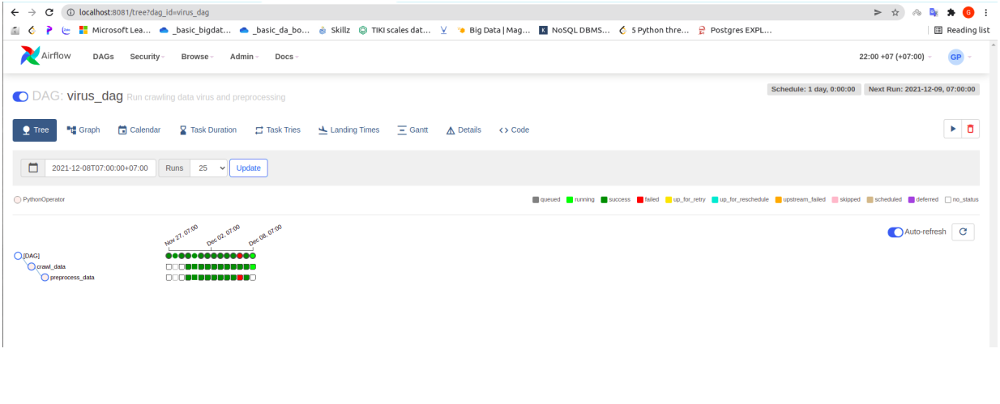

# Extract, Transform and Load project

## The project schedule ETL workflow with Apache Airflow

We perform crawling data from the website: https://www.worldometers.info/, then transform data for rightness and save data to local machine.

Thank to advantages of [Apache Airflow](https://airflow.apache.org/) - a tool for monitoring and scheduling jobs in an automated way, we take advantage of the tool applying on our project in order to schedule and automatic crawl data from the source.

## Stack
* Version <table>

    <tr>
        <td>Airflow</td>
        <td>2.2.3</td>
    </tr>
    <tr>
        <td>Python</td>
        <td>3.9.7</td>
    </tr>
    <tr>
        <td>Jupyter Notebook</td>
        <td>7.29.0</td>
    </tr>
   </table>
   
## Use Apache Airflow for automatic workflow

</img>

## Guide to run the project
* Step 1: Clone the project into your computer
* Step 2: Activate Airflow environment: <b>source airflow-venv/bin/activate</b>
* Step 3: Run Airflow server: <b>airflow webserver -p 8081</b>
* Step 4: Run Airflow scheduler: <b>airflow scheduler</b>
* Step 5: Open web browser and access to http://localhost:8081/
